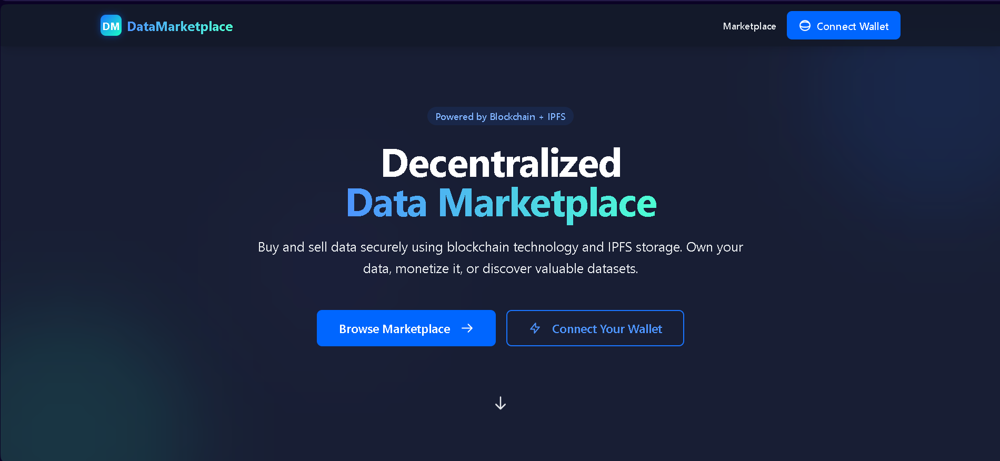

# Decentralized Data Marketplace

A blockchain-powered platform for buying and selling data securely using Ethereum smart contracts and IPFS storage.



## Table of Contents

- [Overview](#overview)
- [Features](#features)
- [Technology Stack](#technology-stack)
- [Project Structure](#project-structure)
- [Getting Started](#getting-started)
  - [Prerequisites](#prerequisites)
  - [Installation](#installation)
- [Smart Contract](#smart-contract)
- [Frontend](#frontend)
- [Usage](#usage)
- [Contributing](#contributing)
- [License](#license)

## Overview

The Decentralized Data Marketplace is a platform that enables users to monetize their data by listing it on a secure blockchain marketplace. Companies can discover and purchase valuable datasets, with all transactions secured by Ethereum smart contracts. Data files are stored using IPFS (InterPlanetary File System) to ensure decentralization and integrity.

## Features

- **User Registration** - Register as either a data provider (user) or a data buyer (company)
- **Data Listing** - Upload data to IPFS and create marketplace listings with custom pricing
- **Browse Marketplace** - Discover available datasets filtered by category
- **Secure Transactions** - Purchase data with cryptocurrency through smart contracts
- **Data Management** - Manage your uploaded and purchased datasets
- **Wallet Integration** - Seamless connection with Ethereum wallets
- **User Dashboard** - Track your uploads, sales, and earnings
- **Company Dashboard** - Access and manage purchased datasets

## Technology Stack

### Blockchain/Backend
- Solidity (Smart Contracts)
- Hardhat (Development Environment)
- Ethereum Blockchain
- IPFS (InterPlanetary File System) for decentralized storage

### Frontend
- React.js
- Vite (Build Tool)
- TailwindCSS
- Ethers.js (Blockchain Interaction)

## Project Structure

```
├── blockchain/              # Smart contract files
│   ├── contracts/           # Solidity smart contracts
│   ├── test/                # Smart contract tests
│   ├── ignition/            # Deployment modules
│   └── hardhat.config.js    # Hardhat configuration
│
├── frontend/                # React frontend application
│   ├── public/              # Static assets
│   ├── src/                 # Source files
│   │   ├── assets/          # Images and resources
│   │   ├── components/      # Reusable UI components
│   │   ├── context/         # React context providers
│   │   ├── pages/           # Application pages
│   │   └── utils/           # Utility functions
│   └── package.json         # Frontend dependencies
```

## Getting Started

### Prerequisites

- Node.js (v14.x or higher)
- npm or yarn
- MetaMask or another Ethereum wallet
- Git

### Installation

1. Clone the repository:
```bash
git clone https://github.com/yourusername/decentralized-data-marketplace.git
cd decentralized-data-marketplace
```

2. Install the smart contract dependencies:
```bash
cd blockchain
npm install
```

3. Start a local blockchain node
```bash
npx hardhat node
```

4. Open a new terminal window and compile and deploy the smart contracts:
```bash
npx hardhat compile
npx hardhat ignition deploy ./ignition/modules/DataMarketplace.js --network localhost
```

4. Install frontend dependencies:
```bash
cd ../frontend
npm install
```

5. Create a `.env` file in the frontend directory with:
```
VITE_CONTRACT_ADDRESS=<your_deployed_contract_address>
VITE_IPFS_GATEWAY=https://ipfs.io/ipfs/
```

6. Start the development server:
```bash
npm run dev
```

7. Open your browser and navigate to `http://localhost:5173`

## Smart Contract

The `DataMarketplace.sol` contract handles:

- User and company registration
- Data asset listing and management
- Purchase and access control for data assets
- Funds management and withdrawals

Key contract functions:
- `registerAsUser()` - Register as a data provider
- `registerAsCompany()` - Register as a data buyer
- `listDataAsset()` - Create a new data listing
- `buyData()` - Purchase a data asset
- `withdraw()` - Withdraw earned funds

## Frontend

The React frontend provides an intuitive interface for interacting with the marketplace:

- **HomePage** - Landing page with feature overview
- **MarketplacePage** - Browse and filter available data assets
- **UploadPage** - Upload and list new data assets
- **UserDashboardPage** - Manage your listings and earnings
- **CompanyDashboardPage** - Access purchased datasets

## Usage

1. **Connect Wallet** - Use MetaMask or another Web3 wallet to connect to the platform
2. **Register** - Choose to register as either a User (data provider) or Company (data buyer)
3. **Upload Data (Users)** - Go to the Upload page to create new data listings
4. **Browse Marketplace** - Discover datasets available for purchase
5. **Purchase Data (Companies)** - Buy data assets with cryptocurrency
6. **Manage Assets** - Access your dashboard to view uploads, purchases, and earnings

## License

This project is licensed under the MIT License - see the LICENSE file for details.